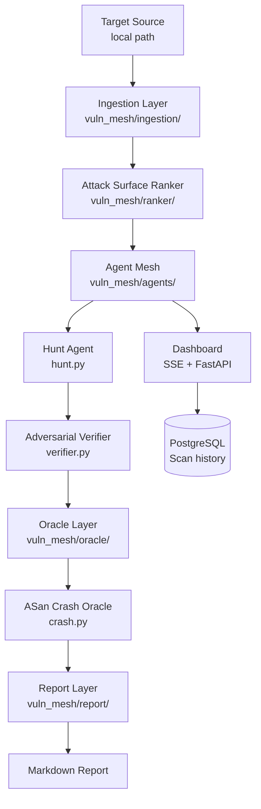

# vuln-mesh

> **Authorized use only.** Only analyze source code you own or have explicit written permission to test. Unauthorized scanning may be illegal in your jurisdiction.

A model-agnostic vulnerability discovery pipeline using layered LLM agents to find and verify security bugs in C/C++ source code. Inspired by [Anthropic's Project Glasswing](https://www.anthropic.com/glasswing).

## Architecture



### Pipeline Stages

| Stage | Module | What it does |
|---|---|---|
| **Ingestion** | `vuln_mesh/ingestion/` | Walks local path, detects C/C++ files, builds dependency graph |
| **Ranker** | `vuln_mesh/ranker/` | Scores files by unsafe call density + size + entry-point depth |
| **Agent Mesh** | `vuln_mesh/agents/` | Hunt agent finds bugs; adversarial verifier tries to disprove them |
| **Oracle** | `vuln_mesh/oracle/` | Compiles with ASan, runs exploit input, confirms real crashes |
| **Report** | `vuln_mesh/report/` | Writes Markdown report with CVSS estimates and finding hashes |
| **Adapters** | `vuln_mesh/adapters/` | Unified `async complete()` interface — Anthropic, Ollama, extensible |
| **Dashboard** | `vuln_mesh/dashboard/` | Real-time web UI over SSE; scan history stored in PostgreSQL |

What makes this different from a scanner: each hunt agent reasons about a single file in full context — attack surface, call graph position, data flow — not just pattern matching. The oracle is ground truth, not LLM opinion. Findings that can't be crash-reproduced are filtered out automatically.

## Requirements

- Python 3.11+
- `gcc` or `clang` with AddressSanitizer support (for oracle verification)
- At least one model backend (Anthropic API key or a running Ollama instance)

## Installation

```bash
pip install -e ".[dev]"
```

## Usage

```bash
# Scan a local directory
vuln-mesh --source ./path/to/target --output report.md

# With custom config and dashboard
vuln-mesh --config config/default.yaml --source ./target --top-n 50 --dashboard

# Dashboard-only server (no auto-scan, runs scans via env var on boot)
SCAN_TARGET=./target uvicorn vuln_mesh.dashboard.server:app --port 8000
```

## Configuration

Edit `config/default.yaml`:

```yaml
target:
  source: ./target

ranker:
  top_n: 200        # null = all files
  min_score: 0.4    # drop files below this score

agents:
  concurrency: 32
  model_profile: triage
  verifier_profile: verifier

adapters:
  triage:
    provider: ollama
    model: qwen2.5-coder:32b
    base_url: http://localhost:11434
  verifier:
    provider: anthropic
    model: claude-sonnet-4-6
    api_key: ""    # or set ANTHROPIC_API_KEY
```

You can assign different model backends to different pipeline stages. Adding a new provider means implementing one `async complete(messages, system, max_tokens) -> str` method.

## Dashboard

The real-time web dashboard visualises pipeline execution as it runs: live file queue, active agent count, confirmed findings, and a scrolling event log.

To run locally:

```bash
ADMIN_USER=admin ADMIN_PASS=changeme \
uvicorn vuln_mesh.dashboard.server:app --host 0.0.0.0 --port 8000
```

Open `http://localhost:8000` — a login screen will appear. Leave `ADMIN_PASS` empty to run without authentication (local dev).

## Deployment (Railway)

Create **three services** in the same Railway project:

| Service | Build | Notes |
|---|---|---|
| **backend** | `Dockerfile.backend` | Main API + SSE server |
| **frontend** | `Dockerfile.frontend` | nginx static file server |
| **postgres** | Railway PostgreSQL plugin | Auto-injects `DATABASE_URL` |

### Backend environment variables

| Variable | Required | Description |
|---|---|---|
| `ANTHROPIC_API_KEY` | if using Anthropic | Model API key |
| `DATABASE_URL` | yes (auto-injected) | PostgreSQL connection string |
| `ADMIN_USER` | yes | Login username (e.g. `admin`) |
| `ADMIN_PASS` | yes | Login password (e.g. `edu123`) |
| `CORS_ORIGINS` | yes | Frontend public URL from Railway |
| `SCAN_TARGET` | no | Auto-start scan on boot |
| `PORT` | auto | Injected by Railway |

### Frontend environment variables

| Variable | Required | Description |
|---|---|---|
| `BACKEND_URL` | yes | Backend public URL from Railway |
| `PORT` | auto | Injected by Railway |

### Step-by-step

1. Fork / connect this repo to Railway
2. Create a new project → **Add Service → GitHub Repo** (repeat for backend and frontend)
3. For each service: **Settings → Build → Dockerfile Path**
   - backend → `Dockerfile.backend`
   - frontend → `Dockerfile.frontend`
4. Add the **PostgreSQL plugin** and link it to the backend service
5. Set the environment variables above on each service
6. Deploy — Railway health check hits `GET /api/health` on the backend

## Running Tests

```bash
pytest
```

Oracle tests require a C compiler with ASan support and are skipped automatically if none is found. DB tests use SQLite in-memory (no PostgreSQL needed).

## OpenSpec

Specs for all implemented features live in `.openspec/specs/`. Each module has a corresponding spec file with acceptance criteria, test plan, and technical notes.

## v0.1 Scope

| Feature | Status |
|---|---|
| Local path ingestion, C/C++ | ✅ |
| Heuristic ranker (unsafe calls + size + depth) | ✅ |
| Hunt agent + adversarial verifier | ✅ |
| ASan crash oracle | ✅ |
| Markdown report with CVSS estimates | ✅ |
| Anthropic + Ollama adapters | ✅ |
| Real-time web dashboard (SSE) | ✅ |
| PostgreSQL scan history | ✅ |
| Username + password authentication | ✅ |
| Railway deployment (backend + frontend + DB) | ✅ |
| SARIF output | v0.2 |
| UBSan oracle | v0.2 |
| Variant hunter | v0.2 |
| Git URL / tarball ingestion | v0.2 |

---

**Developer:** Eduardo Arana — **License:** [MIT](LICENSE)

[](https://ko-fi.com/H2H51MPWG)
