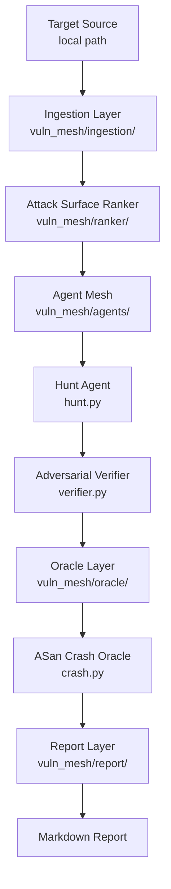

# vuln-mesh

A model-agnostic vulnerability discovery pipeline using layered LLM agents to find and verify security bugs in C/C++ source code. Inspired by [Anthropic's Project Glasswing](https://www.anthropic.com/glasswing).

## Architecture



### Pipeline Stages

| Stage | Module | What it does |
|---|---|---|
| **Ingestion** | `vuln_mesh/ingestion/` | Walks local path, detects C/C++ files, builds dependency graph |
| **Ranker** | `vuln_mesh/ranker/` | Scores files by unsafe call density + size + entry-point depth |
| **Agent Mesh** | `vuln_mesh/agents/` | Hunt agent finds bugs; adversarial verifier tries to disprove them |
| **Oracle** | `vuln_mesh/oracle/` | Compiles with ASan, runs exploit input, confirms real crashes |
| **Report** | `vuln_mesh/report/` | Writes Markdown report with CVSS estimates and finding hashes |
| **Adapters** | `vuln_mesh/adapters/` | Unified `async complete()` interface — Anthropic, Ollama, extensible |

What makes this different from a scanner: each hunt agent reasons about a single file in full context — attack surface, call graph position, data flow — not just pattern matching. The oracle is ground truth, not LLM opinion. Findings that can't be crash-reproduced are filtered out automatically.

## Requirements

- Python 3.11+
- `clang` or `gcc` with AddressSanitizer support (for oracle verification)
- Access to at least one model backend (Anthropic API or Ollama)

## Installation

```bash
pip install -e ".[dev]"
```

Or with Docker:

```bash
docker build -t vuln-mesh .
docker run --rm vuln-mesh --help
```

## Usage

```bash
# Basic scan against a local directory
vuln-mesh --source ./path/to/target --output report.md

# With custom config
vuln-mesh --config config/default.yaml --source ./ffmpeg-src --top-n 50
```

## Configuration

Edit `config/default.yaml`:

```yaml
target:
  source: ./target

ranker:
  top_n: 200        # null = all files
  min_score: 0.4    # drop files below this score

agents:
  concurrency: 32
  model_profile: triage    # adapter for hunt agents
  verifier_profile: verifier

adapters:
  triage:
    provider: ollama
    model: qwen2.5-coder:32b
    base_url: http://localhost:11434
  verifier:
    provider: anthropic
    model: claude-sonnet-4-6
    api_key: ""    # or set ANTHROPIC_API_KEY
```

You can assign different model backends to different pipeline stages. The adapter interface is a single `async complete(messages, system, max_tokens) -> str` — adding a new provider means implementing one method.

## Running Tests

```bash
pytest
```

Oracle tests require a C compiler (`clang` or `gcc`) with ASan support and are automatically skipped if none is available.

## Example: Scan FFmpeg

```bash
bash examples/scan_ffmpeg.sh /tmp/ffmpeg-src
```

## OpenSpec

Specs for all implemented features live in `.openspec/specs/`. Each module has a corresponding spec file defining acceptance criteria and test plan.

## v0.1 Scope

| Feature | Status |
|---|---|
| Local path ingestion, C/C++ | ✅ |
| Heuristic ranker (unsafe calls + size + depth) | ✅ |
| Hunt agent + adversarial verifier | ✅ |
| ASan crash oracle | ✅ |
| Markdown report with CVSS estimates | ✅ |
| Anthropic + Ollama adapters | ✅ |
| SARIF output | v0.2 |
| UBSan oracle | v0.2 |
| Variant hunter | v0.2 |
| Git URL / tarball ingestion | v0.2 |

---

**Developer:** Eduardo Arana — **License:** [MIT](LICENSE)

[](https://ko-fi.com/H2H51MPWG)
