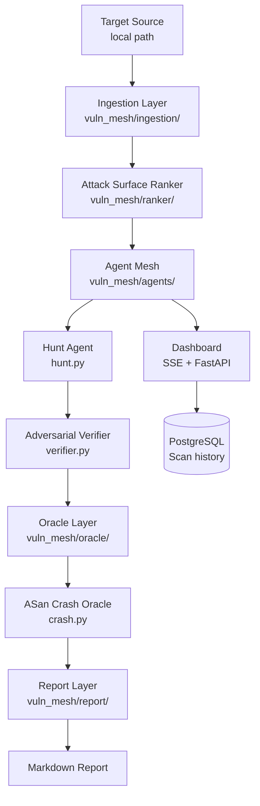

# vuln-mesh

> **Authorized use only.** Only analyze source code you own or have explicit written permission to test. Unauthorized scanning may be illegal in your jurisdiction.

A model-agnostic vulnerability discovery pipeline using layered LLM agents to find and verify security bugs in C/C++ source code. Inspired by [Anthropic's Project Glasswing](https://www.anthropic.com/glasswing).

## Architecture



### Pipeline Stages

| Stage | Module | What it does |
|---|---|---|
| **Ingestion** | `vuln_mesh/ingestion/` | Walks local path, detects C/C++ files, builds dependency graph |
| **Ranker** | `vuln_mesh/ranker/` | Scores files by unsafe call density + size + entry-point depth |
| **Agent Mesh** | `vuln_mesh/agents/` | Hunt agent finds bugs; adversarial verifier tries to disprove them |
| **Oracle** | `vuln_mesh/oracle/` | Compiles with ASan, runs exploit input, confirms real crashes |
| **Report** | `vuln_mesh/report/` | Writes Markdown report with CVSS estimates and finding hashes |
| **Adapters** | `vuln_mesh/adapters/` | Unified `async complete()` interface — Anthropic, Ollama, extensible |
| **Dashboard** | `vuln_mesh/dashboard/` | Real-time web UI over SSE; scan history stored in PostgreSQL |

## Requirements

- Python 3.11+
- `gcc` or `clang` with AddressSanitizer support (for oracle verification)
- At least one model backend (Anthropic API key or a running Ollama instance)

## Installation

```bash
pip install -e ".[dev]"
```

## Usage

```bash
# Scan a local directory
vuln-mesh --source ./path/to/target --output report.md

# With dashboard
vuln-mesh --config config/default.yaml --source ./target --dashboard

# Dashboard-only server (no auto-scan on boot)
uvicorn vuln_mesh.dashboard.server:app --port 8000
```

## Configuration

Edit `config/default.yaml`:

```yaml
ranker:
  top_n: 200
  min_score: 0.4

agents:
  concurrency: 32
  model_profile: triage
  verifier_profile: verifier

adapters:
  triage:
    provider: ollama
    model: qwen2.5-coder:32b
    base_url: http://localhost:11434
  verifier:
    provider: anthropic
    model: claude-sonnet-4-6
    api_key: ""    # or set ANTHROPIC_API_KEY
```

## Dashboard

The real-time web dashboard shows live file queue, active agent count, confirmed findings, and an event log. To run locally:

```bash
ADMIN_USER=admin ADMIN_PASS=changeme \
uvicorn vuln_mesh.dashboard.server:app --host 0.0.0.0 --port 8000
```

Open `http://localhost:8000` — a login screen will appear. Leave `ADMIN_PASS` empty to skip authentication in local dev.

---

## Railway Deployment

> The **backend serves both the API and the dashboard UI**. You only need one service to get a working deployment.

### Option A — Single service (recommended)

```
Railway project
  └── backend service  ← Dockerfile.backend (API + dashboard UI)
  └── PostgreSQL plugin
```

**Steps:**
1. New project → **Add Service → GitHub Repo** → this repo
2. Railway reads `railway.toml` → builds `Dockerfile.backend` automatically
3. Add **PostgreSQL** plugin → link it to the backend service
4. Set environment variables on the backend service:

| Variable | Example | Notes |
|---|---|---|
| `ADMIN_USER` | `admin` | Dashboard login username |
| `ADMIN_PASS` | `edu123` | Dashboard login password |
| `ANTHROPIC_API_KEY` | `sk-ant-...` | Required if using Anthropic models |
| `DATABASE_URL` | *(auto-injected)* | Set by the PostgreSQL plugin |
| `CORS_ORIGINS` | `*` | Keep as `*` for single-service setup |

5. Deploy → visit the public URL → login screen appears

---

### Option B — Two services (backend API + nginx frontend)

```
Railway project
  └── backend service   ← Dockerfile.backend (API only)
  └── frontend service  ← services/frontend/Dockerfile (nginx + static UI)
  └── PostgreSQL plugin
```

**When to use:** if you want a CDN-cacheable frontend separate from the API.

**Steps:**
1. Create the **backend service** (same as Option A, but also set `CORS_ORIGINS` to the frontend's public URL)
2. Create a **second service** → same GitHub repo → in Railway UI set:
   - **Settings → Build → Dockerfile Path**: `services/frontend/Dockerfile`
3. On the **frontend service**, set:

| Variable | Example | Notes |
|---|---|---|
| `BACKEND_URL` | `https://vuln-mesh-backend.up.railway.app` | Backend's public Railway URL |

4. Set `CORS_ORIGINS` on the backend to the frontend's public URL
5. Deploy both → visit the frontend URL → login screen appears

---

## Running Tests

```bash
pytest
```

Oracle tests require a C compiler with ASan support and are skipped automatically if none is found. DB tests use SQLite in-memory — no PostgreSQL needed.

## OpenSpec

All implemented features have specs in `.openspec/specs/`. Each spec has acceptance criteria, test plan, and implementation notes.

## v0.1 Scope

| Feature | Status |
|---|---|
| Local path ingestion, C/C++ | ✅ |
| Heuristic ranker (unsafe calls + size + depth) | ✅ |
| Hunt agent + adversarial verifier | ✅ |
| ASan crash oracle | ✅ |
| Markdown report with CVSS estimates | ✅ |
| Anthropic + Ollama adapters | ✅ |
| Real-time web dashboard (SSE) | ✅ |
| PostgreSQL scan history | ✅ |
| Username + password authentication | ✅ |
| Railway deployment (single + two-service) | ✅ |
| Mobile-responsive dashboard | ✅ |
| SARIF output | v0.2 |
| UBSan oracle | v0.2 |
| Variant hunter | v0.2 |
| Git URL / tarball ingestion | v0.2 |

---

**Developer:** Eduardo Arana — **License:** [MIT](LICENSE)

[](https://ko-fi.com/H2H51MPWG)
