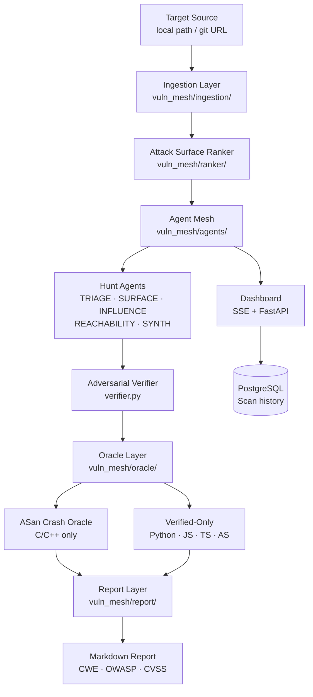

# vuln-mesh

> **Authorized use only.** Only analyze source code you own or have explicit written permission to test. Unauthorized scanning may be illegal in your jurisdiction.

A model-agnostic vulnerability discovery pipeline using layered LLM agents to find and verify security bugs in **C, C++, Python, JavaScript, TypeScript, Node.js, and ActionScript** source code. Vulnerability classification follows **OWASP Top 10** and **CWE** taxonomies. Inspired by [Anthropic's Project Glasswing](https://www.anthropic.com/glasswing).

## Architecture



### Pipeline Stages

| Stage | Module | What it does |
|---|---|---|
| **Ingestion** | `vuln_mesh/ingestion/` | Walks local path, detects source files (C/C++/Python/JS/TS/ActionScript), builds dependency graph with relative include resolution |
| **Ranker** | `vuln_mesh/ranker/` | Scores files by unsafe call density + size + entry-point depth; configurable weights; directed BFS for reachability |
| **Agent Mesh** | `vuln_mesh/agents/` | 5 hunt dimensions (TRIAGE/SURFACE/INFLUENCE/REACHABILITY/SYNTH) find bugs with CWE/OWASP classification; adversarial verifier disproves false positives |
| **Oracle** | `vuln_mesh/oracle/` | Compiles C/C++ with ASan and runs exploit input; non-compilable languages get VERIFIED or SKIPPED status |
| **Report** | `vuln_mesh/report/` | Markdown report with CWE IDs, OWASP categories, CVSS estimates, and categorized sections (CRASHED/COMPILE_ERROR/VERIFIED) |
| **Adapters** | `vuln_mesh/adapters/` | Unified `async complete()` with exponential backoff retry; Anthropic, Cloudflare, Ollama; capability declarations |
| **Dashboard** | `vuln_mesh/dashboard/` | Real-time web UI over SSE; scan history and discarded findings stored in PostgreSQL |

## Supported Languages

| Language | File Extensions | Oracle | Vulnerability Patterns |
|---|---|---|---|
| C/C++ | `.c`, `.h`, `.cpp`, `.cc`, `.cxx`, `.hpp` | ASan crash | Buffer overflow (CWE-120), use-after-free (CWE-416), format string (CWE-134), integer overflow (CWE-190) |
| Python | `.py` | Verified-only | Command injection (CWE-78), SQL injection (CWE-89), path traversal (CWE-22), insecure deserialization (CWE-502) |
| JavaScript/TypeScript | `.js`, `.ts`, `.jsx`, `.tsx` | Verified-only | XSS (CWE-79), prototype pollution (CWE-1321), SSRF (CWE-918), command injection (CWE-78) |
| ActionScript | `.as` | Verified-only | `navigateToURL`, `ExternalInterface.call`, `Security.allowDomain`, `eval` |

## Requirements

- Python 3.11+
- `gcc` or `clang` with AddressSanitizer support (for C/C++ oracle verification)
- At least one model backend (Anthropic API key, Cloudflare Workers AI, or a running Ollama instance)

## Installation

```bash
pip install -e ".[dev]"
```

## Usage

```bash
# Scan a local directory
vuln-mesh --source ./path/to/target --output report.md

# With dashboard
vuln-mesh --config config/default.yaml --source ./target --dashboard

# Dashboard-only server (no auto-scan on boot)
uvicorn vuln_mesh.dashboard.server:app --port 8000
```

## Configuration

Edit `config/default.yaml`:

```yaml
ranker:
  top_n: 200
  min_score: 0.4
  weights:
    surface: 0.5
    influence: 0.2
    reachability: 0.3

agents:
  concurrency: 32
  model_profile: triage
  verifier_profile: verifier

adapters:
  triage:
    provider: ollama
    model: qwen2.5-coder:32b
    base_url: http://localhost:11434
  verifier:
    provider: anthropic
    model: claude-sonnet-4-6
    api_key: ""    # or set ANTHROPIC_API_KEY
```

## Dashboard

The real-time web dashboard shows live file queue, active agent count, confirmed findings, and an event log. To run locally:

```bash
ADMIN_USER=admin ADMIN_PASS=changeme \
uvicorn vuln_mesh.dashboard.server:app --host 0.0.0.0 --port 8000
```

Open `http://localhost:8000` — a login screen will appear. Leave `ADMIN_PASS` empty to skip authentication in local dev.

---

## Railway Deployment

> The **backend serves both the API and the dashboard UI**. You only need one service to get a working deployment.

### Option A — Single service (recommended)

```
Railway project
  └── backend service  ← Dockerfile.backend (API + dashboard UI)
  └── PostgreSQL plugin
```

**Steps:**
1. New project → **Add Service → GitHub Repo** → this repo
2. Railway reads `railway.toml` → builds `Dockerfile.backend` automatically
3. Add **PostgreSQL** plugin → link it to the backend service
4. Set environment variables on the backend service:

| Variable | Example | Notes |
|---|---|---|
| `ADMIN_USER` | `admin` | Dashboard login username |
| `ADMIN_PASS` | `edu123` | Dashboard login password |
| `ANTHROPIC_API_KEY` | `sk-ant-...` | Required if using Anthropic models |
| `DATABASE_URL` | *(auto-injected)* | Set by the PostgreSQL plugin |
| `CORS_ORIGINS` | `*` | Keep as `*` for single-service setup |

5. Deploy → visit the public URL → login screen appears

---

### Option B — Two services (backend API + nginx frontend)

```
Railway project
  └── backend service   ← Dockerfile.backend (API only)
  └── frontend service  ← services/frontend/Dockerfile (nginx + static UI)
  └── PostgreSQL plugin
```

**When to use:** if you want a CDN-cacheable frontend separate from the API.

**Steps:**
1. Create the **backend service** (same as Option A, but also set `CORS_ORIGINS` to the frontend's public URL)
2. Create a **second service** → same GitHub repo → in Railway UI set:
   - **Settings → Build → Dockerfile Path**: `services/frontend/Dockerfile`
3. On the **frontend service**, set:

| Variable | Example | Notes |
|---|---|---|
| `BACKEND_URL` | `https://<your-backend>.up.railway.app` | Backend's public Railway URL (set to your own) |

4. Set `CORS_ORIGINS` on the backend to the frontend's public URL
5. Deploy both → visit the frontend URL → login screen appears

---

## Running Tests

```bash
pytest
```

Oracle tests require a C compiler with ASan support and are skipped automatically if none is found. DB tests use SQLite in-memory — no PostgreSQL needed.

## OpenSpec

All implemented features have specs in `.openspec/specs/`. Each spec has acceptance criteria, test plan, and implementation notes.

## Scope

| Feature | Status |
|---|---|
| Multi-language ingestion (C/C++/Python/JS/TS/ActionScript) | ✅ |
| Relative include resolution | ✅ |
| Directed BFS reachability with configurable weights | ✅ |
| 5-dimension hunt agents (TRIAGE/SURFACE/INFLUENCE/REACHABILITY/SYNTH) | ✅ |
| OWASP/CWE vulnerability classification | ✅ |
| Adversarial verifier | ✅ |
| ASan crash oracle (C/C++) + verified-only (other languages) | ✅ |
| Markdown report with CWE, OWASP, CVSS estimates | ✅ |
| Adapter retry with exponential backoff | ✅ |
| Anthropic + Ollama + Cloudflare adapters | ✅ |
| Real-time web dashboard (SSE) | ✅ |
| PostgreSQL scan history + discarded finding persistence | ✅ |
| Username + password authentication | ✅ |
| Railway deployment (single + two-service) | ✅ |
| SARIF output | planned |
| UBSan oracle | planned |
| Variant hunter | planned |

---

**Developer:** Eduardo Arana — **License:** [MIT](LICENSE)

[](https://ko-fi.com/H2H51MPWG)
